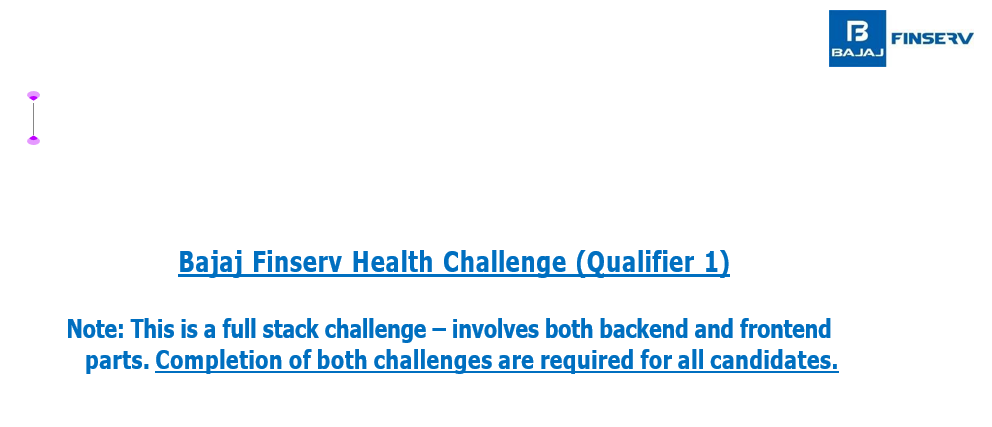
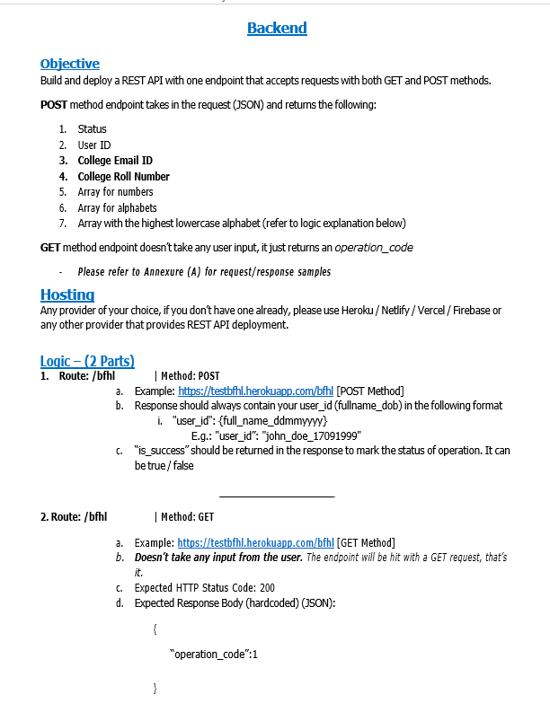
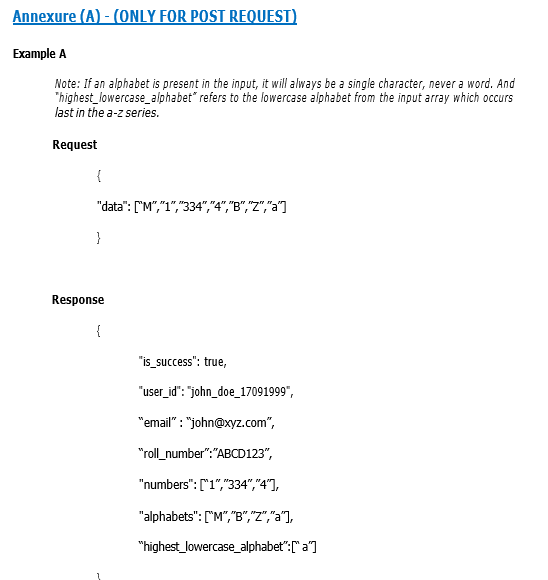
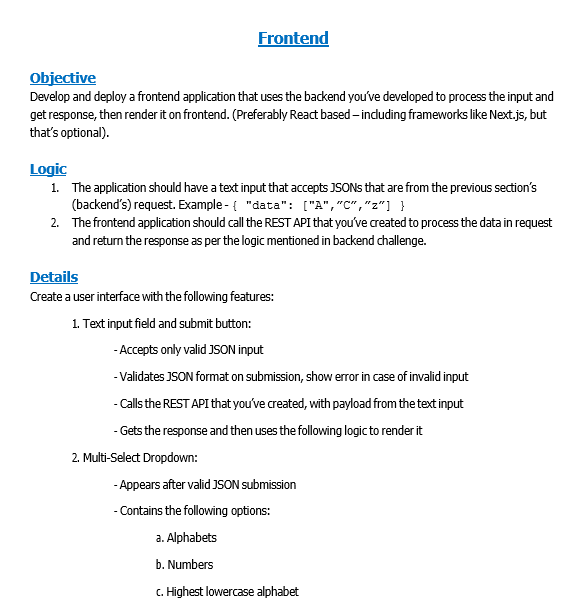

# Bajaj-Finserv-Challenge

## Information Images

| Bajaj-Finserv                |
| ---------------------------- |
|  |

| Backend                          |
| -------------------------------- |
|  |

| Example                          |
| -------------------------------- |
|  |

| Frontend                           |
| ---------------------------------- |
|  |

## Use These Inputs

### Input 1

````json
{
    "data": ["M", "1", "334", "4", "B", "Z", "a"]
}

```
### Input 2
```json
{
    "data": ["A", "C", "z"]
}

```

### Input 3
```json
{
    "data": ["2", "4", "5", "92"]
}

````
